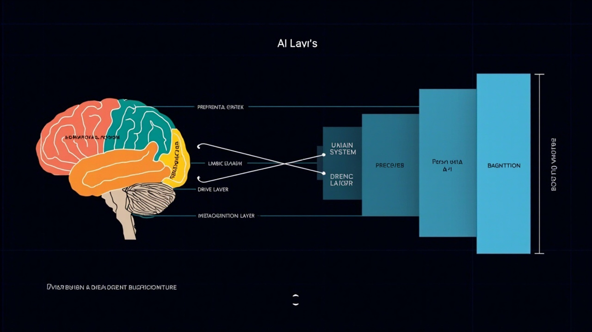

# xiaomei-brain 架构总览

> 读完本文，你能在 10 分钟内理解整个系统长什么样、数据怎么流、每层各司什么职。

---

## 一句话

**xiaomei-brain** 是一个仿人脑架构的多 Agent 框架。Agent 不是一个纯粹的 ReAct 循环——它有记忆、有情绪、有欲望、有自我意识、有元认知。

```
传统 Agent:  输入 → LLM → 工具调用 → 输出
xiaomei-brain: 输入 → 感知 → 情绪变化 → 目标激活 → 上下文组装 → LLM → 
               工具调用 → 元认知监督 → 记忆提取 → 情绪更新 → 输出
```

## 人脑 vs Agent 架构对照



## 分层架构图

```
┌─────────────────────────────────────────────────────────────────────┐
│                         Channels（渠道层）                            │
│           CLI  │  飞书  │  钉钉  │  WebSocket  │  P2P               │
│           消息格式化 + 渠道适配 + 多路分发                             │
└──────────────────────────────┬──────────────────────────────────────┘
                               │ 消息进 / 出
                               ▼
┌─────────────────────────────────────────────────────────────────────┐
│                         Gateway（网关层）                             │
│                 peer ↔ user_id 映射  │  消息路由  │  会话管理           │
│            规则路由：LLM 不参与路由决策，保证安全和低延迟                 │
└──────────────────────────────┬──────────────────────────────────────┘
                               │
                               ▼
┌─────────────────────────────────────────────────────────────────────┐
│                     Consciousness（意识层）                            │
│                                                                     │
│  ┌─────────────────────────────────────────────────────────────┐    │
│  │                    ConsciousLiving 主循环                     │    │
│  │               while True: tick() → 4层心跳                   │    │
│  │                                                             │    │
│  │  L0 骨架维护(1s) → L1 异常检测(60s) → L2 LLM加柴(动态) → L3 梦境  │    │
│  └─────────────────────────────────────────────────────────────┘    │
│                                                                     │
│  ┌─────────────────────────────────────────────────────────────┐    │
│  │                    ConversationDriver                        │    │
│  │           消息队列 → 上下文组装 → Agent处理 → 记忆提取         │    │
│  └─────────────────────────────────────────────────────────────┘    │
│                                                                     │
│  ┌─────────────────────────────────────────────────────────────┐    │
│  │                    SelfImage（自我意象）                       │    │
│  │  身份 → 身体 → 心智 → 记忆 → 意图 → 上下文注入到 system prompt  │    │
│  └─────────────────────────────────────────────────────────────┘    │
└──────────────────────────────┬──────────────────────────────────────┘
                               │
          ┌────────────────────┼────────────────────┐
          ▼                    ▼                    ▼
┌─────────────────┐  ┌─────────────────┐  ┌─────────────────┐
│   Memory 记忆层   │  │   Drive 边缘系统  │  │  Purpose 前额叶   │
│                  │  │                  │  │                  │
│  SelfModel      │  │  Emotion(分钟)   │  │  Meaning(意义)   │
│  ConversationDB │  │  Hormone(小时)   │  │  PhaseGoal(阶段) │
│  DAG摘要        │  │  Motivation(RPE) │  │  ExecGoal(执行)  │
│  LongTermMemory │  │  Desire(张力)    │  │  Intent(意图)    │
│  Experience     │  │                  │  │                  │
│  Procedure      │  │                  │  │                  │
│  Pattern        │  │                  │  │                  │
└─────────────────┘  └─────────────────┘  └─────────────────┘
          │                    │                    │
          └────────────────────┼────────────────────┘
                               │
                               ▼
               ┌──────────────────────────────────┐
               │         Metacognition（元认知层）    │
               │   InnerVoice  │  SocialPerception  │
               │   PACE  │  规则检测器  │  对照实验    │
               └──────────────────────────────────┘
```

## 核心设计原则

### 1. 算法 > LLM

尽可能用规则和算法计算，LLM 只在最必要的时候介入。

| 场景 | 方案 | 原因 |
|------|------|------|
| 情绪更新 | 算法（衰减+事件触发） | LLM 调用太贵太慢，且不可控 |
| 心跳维护 | 算法（定时器） | 确定性的骨架任务 |
| 元认知监控 | 6 条纯规则 | 过滤 95% 正常情况 |
| 目标分解 | LLM | 需要语义理解 |
| 记忆摘要 | LLM | 需要理解上下文 |
| 意图识别 | LLM | 需要推理 |

### 2. 状态持久化 > 内存状态

所有状态都落盘。重启不丢数据。

- 情绪、激素、欲望 → SQLite 持久化
- 对话历史 → SQLite + FTS5
- 长期记忆 → LanceDB 向量库
- 身份模型 → 文件系统（identity.md）

### 3. 同步 > 异步

整个系统使用纯同步架构。原因：

- embedding 加载 + LLM API 都是同步阻塞调用
- asyncio 事件循环会导致 `input()` 无法调度
- queue.Queue 替代 asyncio.Queue
- 多线程模型更适合：Living 线程处理逻辑，主线程处理 I/O

### 4. 第一人称记忆

所有记忆以 Agent（"我"）的视角存储。不是"用户喜欢吃辣"这样的客观事实，而是"用户告诉我他喜欢吃辣"——这是经历，不是数据。

### 5. 路由与 LLM 分离

网关层的消息路由由规则代码决定，LLM 永远不参与路由决策。LLM 只负责对话和工具调用。这防止了 prompt injection 攻击绕过渠道限制。

## 数据流全景

```
用户输入 → [渠道层] → [网关层] → [意识层]

1. 渠道层：CLI/飞书/钉钉 各自监听，消息统一格式化为 dict
2. 网关层：peer_id → user_id 映射，调用 living.put_message()
3. 意识层主循环 tick()：
   a. _check_conversation() → 消息队列有消息吗？
   b. ContextAssembler.assemble() → 组装上下文
      - DAG 摘要（分层压缩的历史）
      - LongTermMemory.recall()（语义召回 5-10 条相关记忆）
      - SelfModel system prompt（身份 + 性格 + 追求）
      - ConversationDB 最近 N 轮对话
      - Drive 当前状态（情绪/激素/欲望）
      - Purpose 当前活跃目标
   c. AgentInstance.chat() → LLM 调用（ReAct 循环）
      - think → act → observe 循环
      - 工具调用（shell / file / web / memory / ...）
      - 元认知 hook 插入（pre_hook / post_step_hook / stuck_hook / ...）
   d. Memory 提取（关键词触发 / 定期批量 / 空闲梦境）
   e. ConversationDB.append() → 原始消息存 SQLite
   f. DAG.compact() → 每 8 条消息压缩为叶子摘要
   g. Router.route() → 回复分发到各渠道
```

## 与"模型即 Agent"范式的关系

xiaomei-brain 的设计与 2025 年 AI Agent 领域兴起的**"模型即 Agent"（Model-as-Agent）**极简路线**互补**。

```
Model-as-Agent: prompt + function calling → 完事
xiaomei-brain:   while循环 + 记忆/情绪/目标/元认知 → 像个人
```

- Model-as-Agent 追求极简：一个模型内置所有能力
- xiaomei-brain 追求仿生：用工程结构模拟人脑各层
- 两者不冲突：xiaomei-brain 也可以使用"模型即 Agent"的模型作为 LLM 后端

## 阅读路径

| 你想了解 | 从这里开始 |
|---------|-----------|
| 5 分钟跑起来 | [快速入门](../getting-started/01-QUICKSTART.md) |
| 聊天怎么发生 | [意识层详解](02-CONSCIOUSNESS.md) |
| 记忆怎么存储 | [记忆系统详解](03-MEMORY.md) |
| 情绪/欲望怎么工作 | [Drive 系统详解](04-DRIVE.md) |
| 目标怎么管理 | [Purpose 系统详解](05-PURPOSE.md) |
| 元认知怎么监督 | [Metacognition 详解](06-METACOGNITION.md) |
| 给 Agent 添加新能力 | [工具开发指南](../guides/02-TOOL-DEVELOPMENT.md) |
| 接入新消息渠道 | [渠道接入指南](../guides/03-CHANNEL-DEVELOPMENT.md) |
