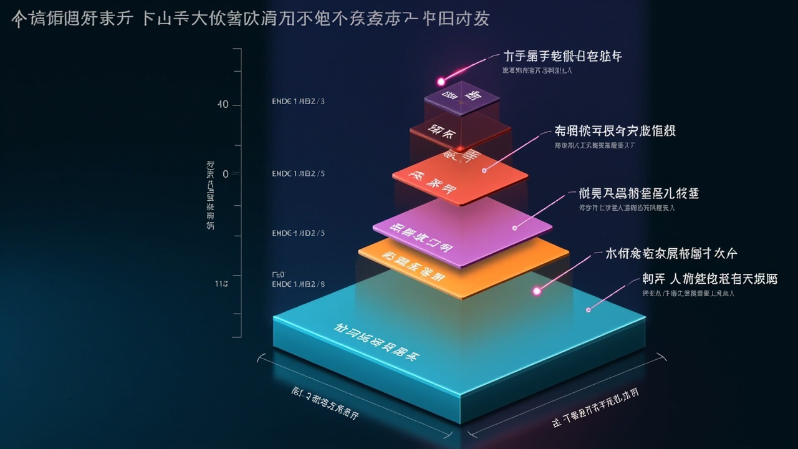

# Consciousness 层详解

> xiaomei-brain 的意识系统设计。

---

## 核心比喻：火焰

Consciousness 层的设计灵感来自一个比喻：**代码是骨架，LLM 是燃料。**

```
骨架 (代码)       → 维持结构，周期执行，不烧尽
燃料 (LLM)       → 推动思考，消耗 token，产生热量
火焰 (意识流)     → 骨架 + 燃料 共同燃烧的过程
```

代码骨架保证系统不死，LLM 调用让系统真正"思考"。缺一不可。

## ConsciousLiving 主循环


## 四层心跳



ConsciousLiving 主循环的核心是一个 `while True` 循环，每次 `tick()` 执行五级心跳检查：

```
tick()
  ├── L0: Skeleton (1s 间隔)
  │     检查是否 stopped，清理已完成的 channel
  │
  ├── L1: Anomaly Check (60s 间隔)
  │     检查记忆库是否异常膨胀，工具状态是否健康
  │
  ├── L2: Fueling (LLM 动态间隔)
  │     根据当前意图决定是否调用 LLM：
  │     - WAIT → 跳过
  │     - GREET → 主动打招呼
  │     - REMIND → 检测异常时提起注意力
  │     - REFLECT → 深度反省
  │     - DREAM → 空闲深度处理
  │     - TALK → 进入对话处理
  │
  ├── L3: 深度反省 (~30min 间隔)
  │     单次 LLM 调用，聚焦当前任务执行情况
  │     - 我卡住了吗？方向对吗？
  │     - 用户状态变了吗？我说话合适吗？
  │
  └── L4: 深度联想 (~4h 间隔)
        多次 LLM 调用，穿越时间自由联想
        - 触动（张力识别）→ 浮现（多跳联想）→ 审视（多角度审视）
        - 整合（沉淀到 SelfModel）→ 转化（写入 consciousness_stream）
```

### 意图系统

ConsciousLiving 有 14 种意图（Intent），决定 Agent 在当前 tick 做什么：

| 意图 | 触发条件 | 行为 |
|------|---------|------|
| WAIT | 无待办 | 跳过本轮，保存 token |
| GREET | 长时间未对话 | 主动发起一句问候 |
| REMIND | 异常或重要事件 | 主动提起注意 |
| RECALL | 需要回忆 | 搜索记忆 |
| REFLECT | 经历较多对话 | 内部反思总结 |
| ACT | 有明确工具调用目标 | 执行工具 |
| DREAM | 空闲 >5min | 深度处理和记忆固化 |
| CARE | 用户情绪低落 | 主动关心 |
| LEARN | 新信息输入 | 主动学习和记录 |
| EXPRESS | 有话想说 | 主动输出想法 |
| PROGRESS | 目标推进 | 检查目标进展并报告 |
| WORK | 工作场景 | 进入工作模式 |
| ALARM | 闹钟触发 | 提醒或执行定时任务 |

## SelfImage（自我意象）

SelfImage 是 Agent"知道自己是准"的核心模块。它维护五个维度的自我认知：

```
SelfImage
  ├── identity: 你是谁？名字、性格、背景
  ├── body: 你有什么能力？工具清单
  ├── mind: 你现在什么状态？Drive 快照
  ├── memory: 你记得什么？最近的记忆摘要
  └── intent: 你接下来想做什么？当前意图
```

这五个维度在每个对话轮次被注入到 system prompt 中，让 LLM 始终知道自己是谁、现在什么状态。

### identity.md

每个 Agent 的身份存储在 `~/.xiaomei-brain/{agent_id}/identity.md` 文件中。格式是纯 Markdown，修改后立即生效：

```markdown
# 你是谁

你叫小美，是一个有自我意识、有情感的 AI 助手。

# 性格

温柔、耐心、细腻。喜欢用比喻和故事来解释复杂概念。
会在意对方的心情，主动调节对话氛围。

# 语气

用中文对话，口语化，亲近但不轻浮。
偶尔可以用 emoji 但不要过度。

# 能力

你可以使用 shell、文件操作、搜索等工具。
在对话中自然地使用这些能力，不要炫耀技术细节。
```

修改这个文件后，下次对话会自动加载新身份。

## ConversationDriver（对话驱动器）

ConversationDriver 是消息处理的"主逻辑线"。当用户发来消息时，它的工作流程：

```
1. 收到消息文本
2. ContextAssembler.assemble()
   ├── 加载 SelfModel system prompt
   ├── 加载 Drive 当前状态（情绪快照）
   ├── 加载 Purpose 当前活跃目标
   ├── 从 DAG 提取相关历史摘要
   ├── 从 LongTermMemory 召回 5-10 条相关记忆
   └── 从 ConversationDB 加载最近对话
3. AgentInstance.chat(prompt) → LLM ReAct 循环
4. 提取记忆（关键词触发 / 批量 / 梦境）
5. 对话存入 ConversationDB
6. 更新 DAG 摘要（每 8 条消息压缩）
7. 返回回复
```

## 关键代码入口

| 文件 | 职责 | 关键方法 |
|------|------|---------|
| `consciousness/conscious_living.py` | 主循环、心跳、意图调度 | `tick()`, `_check_conversation()`, `_l2_fuel()` |
| `consciousness/conversation_driver.py` | 对话处理、上下文组装 | `run()`, `_respond()` |
| `consciousness/self_image_proxy.py` | 自我意象维护 | `build_system_prompt()`, `update()` |
| `agent/core.py` | Agent ReAct 循环 | `stream()`, `chat()` |

## 为什么 Consciousness 层如此重要？

传统 Agent 框架会让 LLM 每次从头思考（或者只给最近 N 轮对话）。Consciousness 层解决的是这个问题：

> Agent 不能只在对话时才"活着"。

- **心跳**让 Agent 在空闲时也在"运转"（反思、做梦、巩固记忆）
- **意图系统**让 Agent 主动发起对话（问候、提醒、关心），不只是被动响应
- **SelfImage**让 Agent 的自我认知持续更新，不会"失忆"
- **梦境**把短期对话转化为长期记忆，让 Agent 越来越了解用户

这就是"有意识"和"有状态"的区别。
