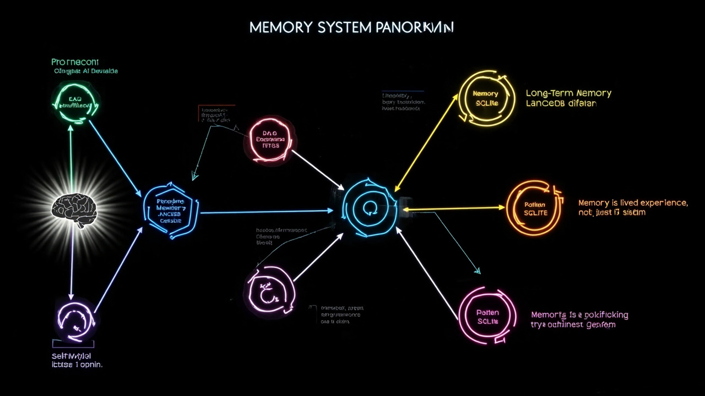
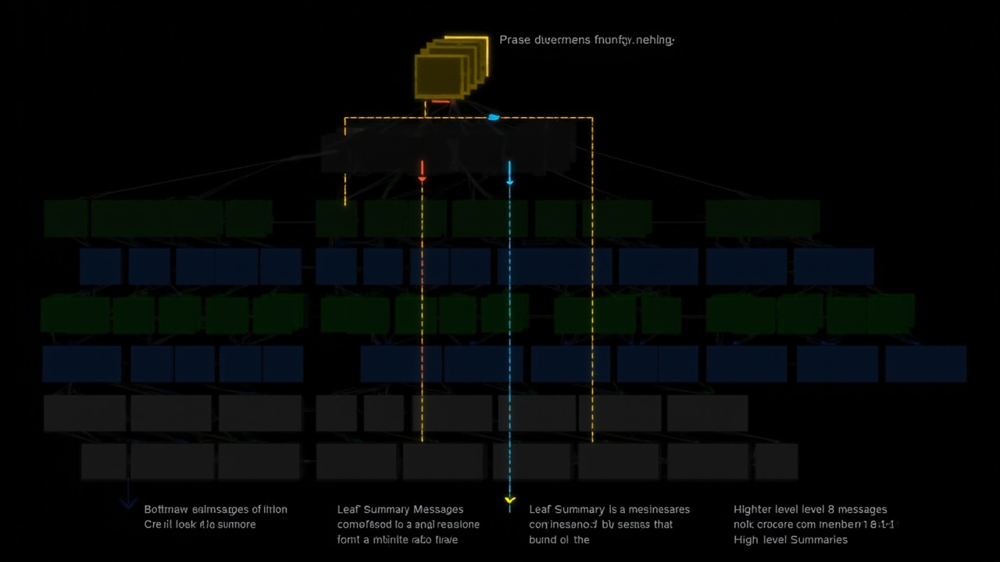

# Memory 层详解

> xiaomei-brain 的记忆系统设计。

---

## 一句话

**xiaomei-brain 的记忆不只是"向量检索"。** 它由 7 个互相协作的子系统组成，模拟人脑不同类型的记忆——从原始对话日志到高度压缩的行为模式。

## 记忆系统全景



```
记忆总容量（SQLite + LanceDB）
│
├── ConversationDB（原始日志）    永不删除，FTS5全文搜索
│    ├── 每次对话的完整记录
│    └── 用于回溯和调试
│
├── DAG 摘要（分层压缩）          每8条消息→一个叶子摘要
│    ├── 叶子节点（8条原始消息压缩）
│    ├── 中层节点（多个叶子合并）
│    ├── 高层节点（更大视角的概括）
│    └── 全局摘要（全部历史）
│
├── LongTermMemory（长期记忆）    向量检索，有强度衰减
│    ├── 关键词触发提取
│    ├── 定期批量提取
│    └── 梦境深度提取
│
├── Experience（经验）           上下文→决策→结果→教训
│    ├── 元认知 post_task_hook 产出
│    ├── 卡住时的策略切换记录
│    └── 成功/失败的完整轨迹
│
├── Procedure（工作流）           可复用的操作序列
│    ├── 工具调用的组合模式
│    └── 从经验中提炼
│
├── Pattern（行为模式）           统计特征
│    ├── 用户偏好统计
│    └── Agent 自身行为模式
│
└── SelfModel（身份模型）         文件系统
     ├── identity.md（性格/语气/追求）
     └── 被注入到每个 system prompt
```

## 存储引擎

| 系统 | 存储引擎 | 搜索方式 |
|------|---------|---------|
| ConversationDB | SQLite + FTS5 | SQL 查询 + 全文搜索 |
| DAG 摘要 | LanceDB + SQLite | 向量检索 + 图遍历 |
| LongTermMemory | LanceDB | 向量语义检索 |
| Experience | SQLite | 按场景查询 |
| Procedure | SQLite | 按标签查询 |
| Pattern | SQLite | 统计分析 |
| SelfModel | 文件系统 | 直接读取 |

### 为什么选 LanceDB？

- **本地嵌入式**：不需要额外部署向量数据库服务
- **持久化**：数据直接写入磁盘文件，重启不丢
- **快速**：支持 GPU 加速，单机百亿级向量检索
- **Python 原生**：与 xiaomei-brain 的 Python 技术栈无缝集成

Embedding 模型使用 **BAAI/bge-m3**（1024 维，中文优化），首次启动时自动下载，约 1.3GB。

## ConversationDB（原始对话日志）

所有对话的原始记录，**永不删除**。

```sql
-- 表结构
CREATE TABLE conversations (
    id INTEGER PRIMARY KEY AUTOINCREMENT,
    user_id TEXT NOT NULL,           -- 用户标识
    session_id TEXT NOT NULL,        -- 会话标识
    role TEXT NOT NULL,              -- 'user' | 'assistant' | 'tool'
    content TEXT NOT NULL,           -- 消息内容
    metadata TEXT,                   -- JSON 元数据（情绪快照等）
    created_at TIMESTAMP DEFAULT CURRENT_TIMESTAMP
);

-- FTS5 全文搜索索引
CREATE VIRTUAL TABLE conversations_fts USING fts5(
    content, content=conversations, content_rowid=id
);
```

### 使用场景

- **获取最近 N 轮**：`SELECT * FROM conversations WHERE user_id=? ORDER BY id DESC LIMIT N`
- **全文搜索**：`SELECT * FROM conversations_fts WHERE conversations_fts MATCH ?`
- **调试回溯**：直接查原始输入输出，不漏任何细节

## DAG 摘要（有向无环图压缩）

DAG 是 xiaomei-brain **最独特的记忆设计**。它把对话历史分层压缩为树状摘要结构。

### 压缩策略



```
原始消息       叶子摘要      中层摘要       高层摘要
[msg1]────┐
[msg2]────┤              ┌──────────┐
[msg3]────┤              │          │
[msg4]────┼─→ [leaf A]──→│          │
[msg5]────┤              │ 中层 1   │──→ [global]
[msg6]────┤              │          │
[msg7]────┤              │          │
[msg8]────┘              └──────────┘
                                    │
[msg9]────┐              ┌──────────┤
[msg10]───┤              │          │
[msg11]───┼─→ [leaf B]──→│ 中层 2   │
[msg12]───┤              │          │
...        │              └──────────┘
```

### 为什么是 8 条消息为一叶？

| 数量 | 效果 |
|------|------|
| < 8 条 | 摘要太细碎，压缩效率低 |
| 8 条 | ≈ 一次有意义的对话片段（3-5 轮问答） |
| > 8 条 | 摘要太长，LLM 容易丢失细节 |

8 条后用 LLM "发现"的上下文窗口（4K token）刚好合适。

### 根节点

任何时候可以通过 DAG 获取"全局摘要"——也就是目前为止整个对话历史的最高层压缩。这相当于 Agent 的"人生回顾"。但注意：

> 全局摘要是元级信息，不包含具体对话细节。要找到具体内容，需要从根节点向下遍历到叶子节点。

这种设计在上下文组装时特别有用：先提供高层摘要（告诉 LLM 整体情况），再根据相关性召回具体叶子（补充细节）。

## LongTermMemory（长期记忆）

长期记忆是 Agent "真正记住"的东西。它在对话中由三个时机提取：

### 1. 关键词触发（Immediate）

当对话中检测到明确的关键词（"记住"、"别忘了"、"很重要"、"这是关键"等）时，立即触发记忆提取并存储。

### 2. 定期批量（Periodic）

每 10 轮对话，系统自动触发一次批量记忆提取：

```python
if conversation_count % 10 == 0:
    batch_extract(conversation_db.last_n(50))
    # 提取：关键信息、用户偏好、重要承诺、情感标记点
```

### 3. 梦境（Dream）

空闲 >5 分钟时触发深度回顾：

```python
if idle_time > 5 * 60:
    dream_cycle()
    # 回顾近期对话 → 提炼关键经验
    # 检查记忆强度 → 加强或衰减
    # DAG 压缩 → 生成高层摘要
```

### 记忆强度衰减

每条长期记忆都有强度值（0.0 ~ 1.0），随时间衰减：

| 等级 | 强度范围 | 说明 |
|------|---------|------|
| Active | 0.8 ~ 1.0 | 刚记住，频繁被召回 |
| Normal | 0.5 ~ 0.8 | 正常使用 |
| Weak | 0.2 ~ 0.5 | 很少被召回 |
| Fading | 0.01 ~ 0.2 | 即将被遗忘 |
| Extinct | < 0.01 | 已消亡，可被清理 |

被成功召回的记忆强度提升（+0.1），长期不用的记忆逐渐衰减。这模拟了人脑的遗忘曲线。

## Experience（经验）

元认知层的 `post_task_hook` 产出被存入经验模块。结构：

```python
{
    "context": "在迁移 Flask 到 FastAPI 时遇到 ORM 差异",
    "decision": "切换到使用 Depends 替代 request",
    "outcome": "成功解决依赖注入问题",
    "lesson": "框架迁移时，先检查依赖注入模式的差异"
}
```

经验被用于：
- 遇到类似问题时给出建议
- 元认知在 stuck_hook 中检索相关经验
- 未来策略选择的参考依据

## Procedure（工作流）

从经验中提炼的可复用操作序列：

```python
{
    "name": "框架迁移检查清单",
    "steps": [
        "检查依赖注入模式差异",
        "检查路由注册方式差异",
        "检查中间件接口差异",
        "检查数据库会话管理差异"
    ],
    "tags": ["migration", "framework"]
}
```

## Pattern（行为模式）

统计层面的行为模式，通过数据驱动发现：

```python
{
    "user_preference": {
        "user_id": "xiaomei",
        "preferred_tone": "温柔",
        "common_topics": ["哲学", "心理学", "AI"]
    },
    "agent_pattern": {
        "frequent_tools": ["web_search", "memory_query"],
        "common_stuck_scenarios": ["框架迁移", "调试随机故障"]
    }
}
```

## 第一人称视角

**核心原则**：所有记忆以 Agent（"我"）的视角存储。

| 客观事实 | 第一人称记忆 |
|---------|-------------|
| 用户喜欢吃辣 | 用户告诉我他喜欢吃辣 |
| 今天是周三 | 我记得今天是周三，因为用户提到了周末计划 |
| 温度 25°C | 今天温度 25°C，用户觉得有点热 |

为什么？

- 记忆是"我为谁记住了什么"，不是客观事实数据库
- 第一人称让记忆提取更自然："我上次和用户聊过…"
- 多人场景中，`user_id` 隔离不同用户的记忆
- 更接近人脑的运作方式

## 记忆查询示例

```python
# 语义搜索
from memory.longterm import LongTermMemory

ltm = LongTermMemory(agent_id="xiaomei")
results = ltm.recall("用户提到过什么爱好", top_k=5)

for r in results:
    print(f"[{r.strength:.2f}] {r.content}")
```

```python
# DAG 摘要查询
from memory.dag import DAGSummaryGraph

dag = DAGSummaryGraph(agent_id="xiaomei")
summary = dag.get_global_summary()  # 获取全局摘要
leaf = dag.get_nearest_leaves("用户的职业")  # 获取相关叶子
```

```python
# 全文搜索
from memory.conversation_db import ConversationDB

db = ConversationDB(agent_id="xiaomei")
results = db.fulltext_search("记住 重要")
```

## 多用户隔离

xiaomei-brain 支持多人对话。每个用户的记忆被 `user_id` 隔离：

- ConversationDB: 按 `user_id` 和 `session_id` 过滤
- LongTermMemory: 按 `user_id` 召回
- DAG: 每个 `user_id` 独立的 DAG 树
- SelfModel: 共享身份，但感知到的社交关系因人而异

```
用户A的记忆 → 只属于用户A，Agent在对话A时提取
用户B的记忆 → 只属于用户B，Agent在对话B时提取
全局知识 → 所有用户共享（文化常识等）
```
