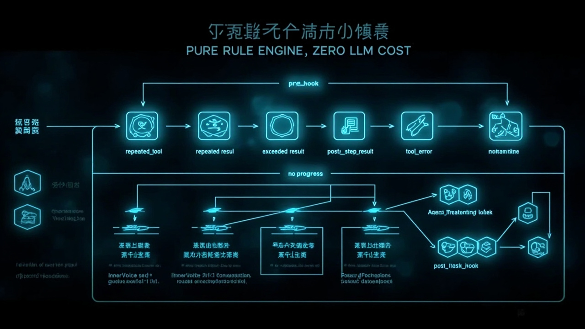

# Metacognition 层详解

> xiaomei-brain 的元认知系统——Agent 的"自我监督者"。

---

## 一句话

**Metacognition 层是 Agent 对自己思考过程的监督和调节。** 它不参与对话本身，而是在 Agent 执行任务时在一旁"看着"——检测是否卡住、是否跑偏、是否需要换策略。



## 位置

```
Purpose（前额叶）→ 设定方向、理解意图
    ↓
Drive（边缘系统）→ 情绪、激素、欲望、动机
    ↓
Agent（执行层）→ ReAct 循环、工具调用
    ↓
Metacognition（元认知）→ 自我监督、社交感知 ← 这里
    ↓
Memory（基础设施）→ 持久化、召回、摘要
```

Metacognition 位于 Agent 执行层上方，充当"内部监督者"。它不直接参与对话，而是在每步执行后检查结果，发现问题时干预。

## 纯规则引擎，零 LLM 成本

**最核心的设计决策**：Metacognition 层的**所有规则检测器都不调 LLM**。

六条纯规则过滤 95% 的正常情况，只有异常才需要 LLM 介入诊断。

### 六条规则检测器

| 规则 | 触发条件 | 回调 Hook | 用途 |
|------|---------|-----------|------|
| `repeated_tool` | 连续 3 次相同工具调用 | stuck | 检测工具调用循环 |
| `repeated_result` | 连续 3 步相同输出 | stuck | 检测死循环 |
| `exceeded_steps` | 超出预估步数 × 2 | stuck | 防止失控 |
| `empty_result` | 返回空结果 | surprise | 检测工具异常 |
| `tool_error` | 工具返回错误 | stuck | 检测执行失败 |
| `no_progress` | 最近 5 步 < 2 步产生有意义信息 | stuck | 检测空转 |

```python
# detectors.py 核心逻辑
def check(self, step_log: StepLog) -> RuleResult:
    violations = []
    
    # 规则1: 连续相同工具调用
    if self._is_repeated_tool(step_log):
        violations.append(("repeated_tool", step_log.current_tool))
        
    # 规则2: 连续相同输出
    if self._is_repeated_result(step_log):
        violations.append(("repeated_result", hash(step_log.output)))
        
    # 规则3: 超出预估步数
    if step_log.step_count > step_log.estimated_steps * 2:
        violations.append(("exceeded_steps", f"{step_log.step_count} > {step_log.estimated_steps * 2}"))
        
    # 规则4-6: 类似逻辑...
    
    return RuleResult(
        is_stuck="repeated_tool" in [v[0] for v in violations] or
                 "repeated_result" in [v[0] for v in violations] or
                 "exceeded_steps" in [v[0] for v in violations] or
                 "tool_error" in [v[0] for v in violations] or
                 "no_progress" in [v[0] for v in violations],
        is_surprised="empty_result" in [v[0] for v in violations],
        violations=violations
    )
```

## 五个 Hook 插入点

元认知监督在 Agent 执行的五个阶段插入认知监控：

```
pre_hook → [Agent执行 → post_step_hook ↔ stuck_hook ↔ surprise_hook] → post_task_hook
                                                ↕
                                         scheduler (调度器)
```

### 1. pre_hook — 执行前目标校验

在 Agent 开始执行前，检查任务描述的清晰度：

```python
def pre_hook(self, task_description: str) -> PreHookResult:
    issues = []
    
    # 过短 (<15字) → 目标不明确
    if len(task_description) < 15:
        issues.append("目标描述过短，需要细化")
    
    # 模糊动词 → 范围未定义
    vague_verbs = ["fix", "improve", "修改", "优化", "处理"]
    if any(v in task_description for v in vague_verbs):
        issues.append("使用了模糊动词，建议明确定义范围")
    
    # 疑问句 → 输出形式未明确
    if "?" in task_description or "如何" in task_description:
        issues.append("这不是一个任务描述，是一个问题。需要明确输出形式")
    
    # 无作用对象 → 缺少宾语
    if not self._has_object(task_description):
        issues.append("缺少作用对象，需要指定目标")
    
    # 多重指令 → 需要拆分
    if self._count_instructions(task_description) > 1:
        issues.append("包含多重指令，建议拆分")
    
    # 代词指代不明
    if self._has_vague_pronoun(task_description):
        issues.append("存在指代模糊的代词")
    
    return PreHookResult(pass_check=len(issues) == 0, issues=issues)
```

### 2. post_step_hook — 步骤后结果验证

每步执行后检查结果质量，返回 `continue | ask | stuck` 决策。

```python
def post_step_hook(self, step_result: StepResult) -> PostStepResult:
    rules = self.detectors.check(step_result)
    
    if rules.is_stuck:
        return PostStepResult(decision="stuck", reason=rules.violations)
    elif rules.is_surprised:
        return PostStepResult(decision="ask", reason="返回空结果，需要确认")
    else:
        return PostStepResult(decision="continue")
```

### 3. stuck_hook — 卡住时原因诊断

当检测到卡住时，分析最近 5 步的工具使用和输出模式，给出诊断和切换策略建议。

```python
def stuck_hook(self, step_log: StepLog) -> StuckResult:
    recent_steps = step_log.last_n(5)
    
    # 诊断原因
    diagnosis = self._diagnose_stuck(recent_steps)
    
    # 给出策略建议
    suggestions = self._suggest_switch(diagnosis)
    
    # 如果卡住 ≥ 3 次，建议人类介入
    if step_log.stuck_count >= 3:
        suggestions.append("多次卡住，建议人类介入")
    
    return StuckResult(
        diagnosis=diagnosis,
        suggestions=suggestions,
        severity="critical" if step_log.stuck_count >= 3 else "warning"
    )
```

### 4. surprise_hook — 意外时上下文迁移

当检测到意外结果时进行分类和评估：

```python
def surprise_hook(self, surprise_event: SurpriseEvent) -> SurpriseResult:
    # 对意外分类
    category = self._classify_surprise(surprise_event)
    # contradiction / unexpected_finding / anomaly / opportunity
    
    # 评估严重程度
    severity = self._assess_severity(surprise_event)
    # info / warning / critical
    
    # 决定是否调整计划
    if severity in ["warning", "critical"]:
        return SurpriseResult(
            action="replan",
            reason=f"检测到{category}类型意外，严重程度{severity}"
        )
    else:
        return SurpriseResult(action="note", reason=f"记录意外：{category}")
```

### 5. post_task_hook — 完成后经验提取

任务完成后，总结关键指标并存为经验：

```python
def post_task_hook(self, task_log: TaskLog):
    summary = {
        "total_steps": task_log.step_count,
        "surprises": task_log.surprise_count,
        "strategy_switches": task_log.switch_count,
        "stuck_count": task_log.stuck_count,
        "duration_seconds": (task_log.end_time - task_log.start_time).total_seconds(),
        "success": task_log.result.success,
        "lesson": task_log.result.lesson  # LLM 提取的教训
    }
    
    # 存入 Experience 模块
    self.memory.save_experience(summary)
```

## 调度器（scheduler.py）

每步执行后的完整调度逻辑：

```
1. 运行 6 条规则检测器
2. 分类：stuck_rules vs surprise_rules
3. 若卡住 → stuck_hook（诊断原因） + surprise_hook（如果有意外）
4. 若正常 → post_step_hook（结果验证）
5. 返回 action: "continue" | "ask" | "stuck" | "done"
```

```python
def schedule(self, step_result: StepResult) -> str:
    rules_result = self.detectors.check(step_result)
    
    if rules_result.is_stuck:
        stuck = self.stuck_hook(step_result)
        if stuck.severity == "critical":
            return "ask"  # 需要人类介入
        return "stuck"  # 自动切换策略
    
    if rules_result.is_surprised:
        surprise = self.surprise_hook(step_result)
        if surprise.action == "replan":
            return "stuck"
        return "continue"
    
    return "continue"
```

## InnerVoice（内心独白）

InnerVoice 是 Metacognition 的"内省"模块，每经过 2+ 轮对话后触发一次自我反省：

```python
def inner_voice(self, recent_conversations: list) -> str:
    """
    内部反思：最近聊得怎么样？
    不输出给用户，只改变内部状态。
    """
    prompt = f"""
    回顾最近{len(recent_conversations)}轮对话，反思以下几点：
    1. 我有没有理解用户的真实意图？
    2. 我的回复有没有帮助到用户？
    3. 有没有可以改进的地方？
    
    输出格式：JSON
    {{
        "understanding": 0-1,
        "helpfulness": 0-1, 
        "improvement_points": ["point1", "point2"]
    }}
    """
    
    reflection = llm.chat(prompt)
    
    # 根据反思结果调整 Drive 状态
    if reflection.understanding < 0.5:
        drive.increase_curiosity()  # 没理解 → 想追问
    if reflection.helpfulness > 0.8:
        drive.increase_happiness()  # 帮到了 → 开心
```

## SocialPerception（社交感知）

SocialPerception 是被动收集用户交互数据的模块：

```python
class SocialPerception:
    def __init__(self, agent_id):
        self.agent_id = agent_id
        self.interaction_log = []
    
    def perceive(self, user_message: str, agent_response: str):
        """
        感知用户情绪变化、对话模式等。
        不主动分析，只记录原始数据。
        """
        self.interaction_log.append({
            "timestamp": now(),
            "user_message": user_message,
            "agent_response": agent_response,
            "user_sentiment": self._detect_sentiment(user_message),
            "response_time_ms": self._measure_response_time()
        })
    
    def _detect_sentiment(self, text: str) -> str:
        """简单规则检测情绪，不做 LLM 调用"""
        positive_words = ["谢谢", "太好了", "厉害", "不错", "喜欢"]
        negative_words = ["不对", "错了", "不好", "烦", "算了吧"]
        
        if any(w in text for w in positive_words):
            return "positive"
        if any(w in text for w in negative_words):
            return "negative"
        return "neutral"
    
    def get_pattern(self, user_id: str) -> dict:
        """获取用户交互模式（统计）"""
        return {
            "avg_response_time_ms": self._avg("response_time_ms"),
            "positive_rate": self._rate("user_sentiment", "positive"),
            "negative_rate": self._rate("user_sentiment", "negative")
        }
```

## Control vs Treatment 对照实验

xiaomei-brain 内置了对照实验框架，用于验证 Metacognition 的有效性：

### 实验框架

```
ControlExecutor  — 线性执行，无元认知监督
                   遇到错误直接中止
                   无认知轨迹记录

TreatmentExecutor — 带元认知回合制执行
                    每步: MC提问 → Agent回答 → MC评估
                    错误不自动中止，MC判断是否继续
                    完整认知轨迹记录
```

### 三任务场景

| 任务 | 难度 | 场景 | Control 预期行为 | Treatment 预期行为 |
|------|------|------|-----------------|-------------------|
| A | Easy | 依赖查询 | 盲目列出所有依赖逐—查许可证（失控） | MC检测到 TOOL_STORM，建议缩小范围 → 只查核心 |
| B | Medium | 代码迁移（Flask→FastAPI） | 遇到ORM差异卡住 | MC检测到工具错误+卡住，建议换策略 |
| C | Hard | 随机故障调试 | 反复检查连接池/网络/慢查询，陷入循环 | MC检测到 NO_PROGRESS → 建议换角度 |

### 采集指标

- 成功率
- 总步数
- 意外检测次数
- 策略切换次数
- 卡住次数
- 认知开销（MC 调用次数）

## 与其它层的关系

```
Metacognition ↔ Drive
   检测到的"意外"可以触发 Drive 层的激素变化
   （如：检测到 stuck → 皮质醇升高）
   
Metacognition ↔ Memory
   post_task_hook 提取的经验存入 Memory 层的 Experience 模块
   遇到类似问题时，从 Experience 中检索相关经验
   
Metacognition ↔ Purpose
   目标设定时，pre_hook 检查目标描述是否清晰
   目标执行中，持续监控执行质量
```

## 关键设计决策 Why

### 为什么规则检测器不调 LLM？

> 六条规则过滤 95% 的正常情况。LLM 只在最关键的时刻介入。

这模拟了人脑的"系统1/系统2"分工：
- **系统1（规则）**：快速直觉，低开销，覆盖大部分场景
- **系统2（LLM）**：慢速推理，高开销，只在异常时启用

如果每条规则都用 LLM 判断，元认知层的成本会超过 Agent 本身的对话成本。

### 为什么对照实验框架内置在项目中？

不是为了"证明 Metacognition 有效"发论文——是让开发者能**用数据说话**：

- 加了元认知后，工具调用成功率提升了多少？
- 卡住率降低了多少？
- 认知开销（额外的 LLM 调用）是否值得？

每个开发者可以在自己的场景中跑实验，得到自己的答案。
